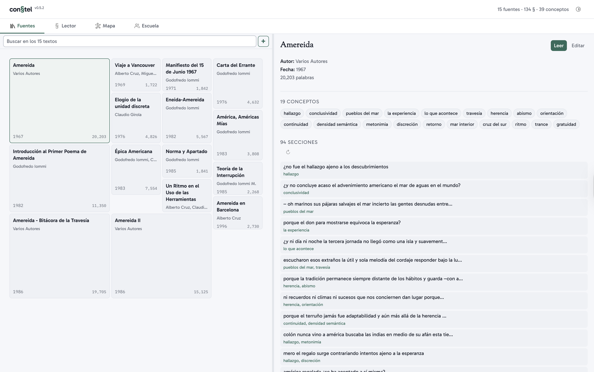
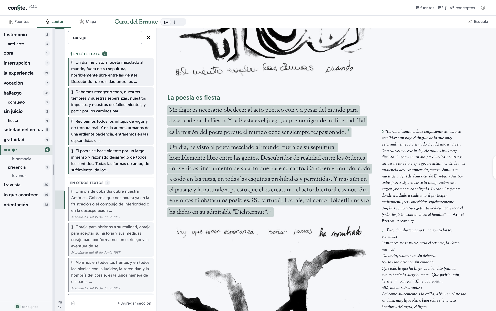
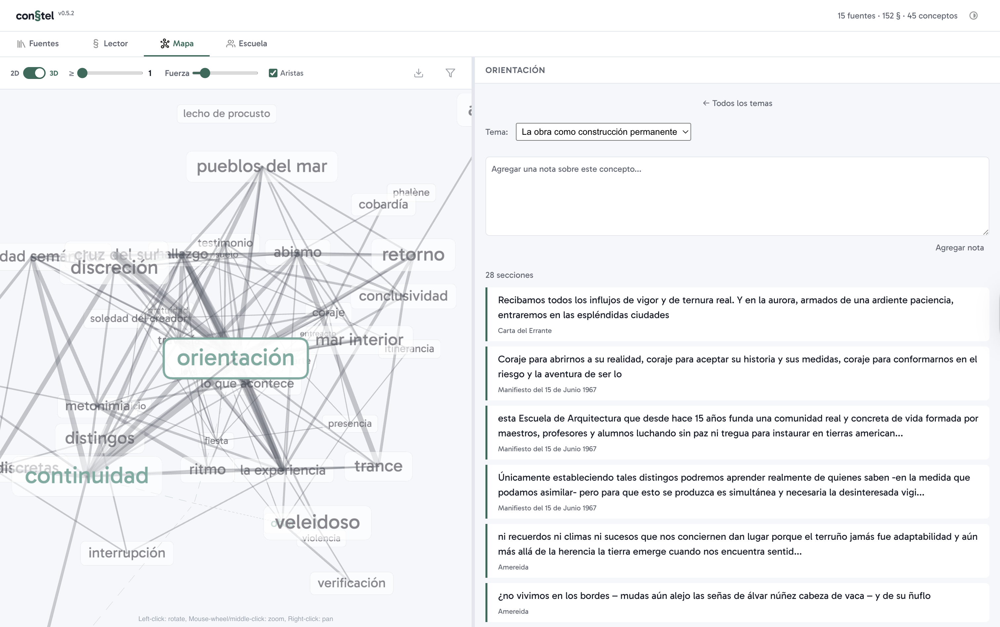

# con§tel-db

**Herramienta colaborativa de analisis tematico de corpus textuales.**

[](https://app.netlify.com/projects/constel-amereida/deploys)

## Fundamentos

con§tel nace de la figura del estudioso que marca y anota los margenes de los libros que lee, poblandolos de palabras recordatorias. Este lector-anotador está en una relación doble con su biblioteca: *ante* el total de los volumenes (vision panoramica) y *dentro* de cada texto (lectura profunda).

con§tel formaliza este proceso de marcacion colectiva para que un grupo de lectores trabaje simultaneamente sobre un corpus compartido. Cada lector selecciona fragmentos, les asigna conceptos y agrupa conceptos en temas. La resultante es un mapa navegable: una constelacion de relaciones conceptuales que emerge de la lectura de todos.

### Las tres unidades

El sistema se articula sobre tres unidades de relacion, definidas en el [paper fundacional](https://wiki.ead.pucv.cl/Con§tel) (Spencer & Sanfuentes, 2005):

- **[§] Seccion** — la unidad de sentido que el lector nota y marca en el texto. Un pasaje citable, delimitado por milestones en el markdown.
- **[a] Concepto** — la palabra clave que permite remitir secciones a una entrada transversal del lexico comun. Cada concepto agrupa todas las secciones que lo invocan, atravesando el total de los textos.
- **[n] Nota** — la anotacion del lector sobre un concepto o tema. Construye continuidad entre secciones y enriquece la red.

## Pestanas

### 1. Fuentes

Grilla del corpus con fichas de cada texto. Los administradores importan y editan las fuentes en markdown.



### 2. Lector

Vista de lectura con marcas interactivas. El lector selecciona texto, asigna conceptos, y navega entre secciones. Las notas al pie se muestran como sidenotes en el margen derecho.



### 3. Mapa

Mapa de conceptos 2D (D3.js) y 3D (Three.js). Los conceptos se agrupan en temas con colores. Filtrable por fuente y por usuario.



### 4. Escuela (admin)

Gestion de usuarios, roles, estadisticas del corpus y log de actividad. Solo visible para administradores.

## Stack

| Capa | Tecnologia |
|------|------------|
| Frontend | Vanilla JS (ES6 modules), sin build step |
| Markdown | marked.js + marked-footnote + poem blocks |
| Mapas | D3.js (2D), 3d-force-graph / Three.js (3D) |
| Backend | Netlify Functions (Node.js serverless) |
| Base de datos | PostgreSQL (Neon) |
| Auth | Netlify Identity (Google OAuth) |
| Hosting | Netlify (CDN + Functions) |
| AI | Claude CLI (auto-anotacion) |

## Documentacion

- **[Arquitectura](docs/ARCHITECTURE.md)** — pipeline de renderizado, modelo de datos, flujos CRUD, permisos, diagramas mermaid
- **[Roadmap](ROADMAP.md)** — fases de desarrollo y features pendientes

## Desarrollo local

```bash
npm install
cp .env.example .env  # configurar DATABASE_URL
npx netlify dev       # arranca en http://localhost:8888
```

Si el puerto queda ocupado de una sesion anterior:

```bash
lsof -ti :3999 -ti :8888 | xargs kill
npx netlify dev
```

## Auto-anotacion

El script `auto-annotate.mjs` usa Claude para proponer conceptos y marcar secciones automaticamente:

```bash
node scripts/auto-annotate.mjs "Nombre de la fuente"
node scripts/auto-annotate.mjs "Nombre" --dry-run  # sin guardar
```

El script es interactivo: Claude propone conceptos, el usuario revisa y confirma, luego Claude genera las secciones con anclas que se resuelven contra el texto.

## Licencia

MIT

---

*e[ad] Escuela de Arquitectura y Diseno, Pontificia Universidad Catolica de Valparaiso* y *Corporación Cultural Amereida*
