# Arquitectura de con§tel-db

## Vision general

con§tel-db es una herramienta colaborativa de analisis tematico de corpus textuales.
Un grupo de lectores trabaja sobre un corpus compartido: seleccionan fragmentos,
les asignan conceptos, y agrupan conceptos en temas. El resultado es un mapa de
relaciones conceptuales que emerge de la lectura colectiva.

## Pipeline de renderizado

El contenido de cada fuente se almacena como **markdown con milestones embebidos**:

```
Texto normal <!-- §b exc_123 -->texto marcado<!-- §e exc_123 --> mas texto.
```

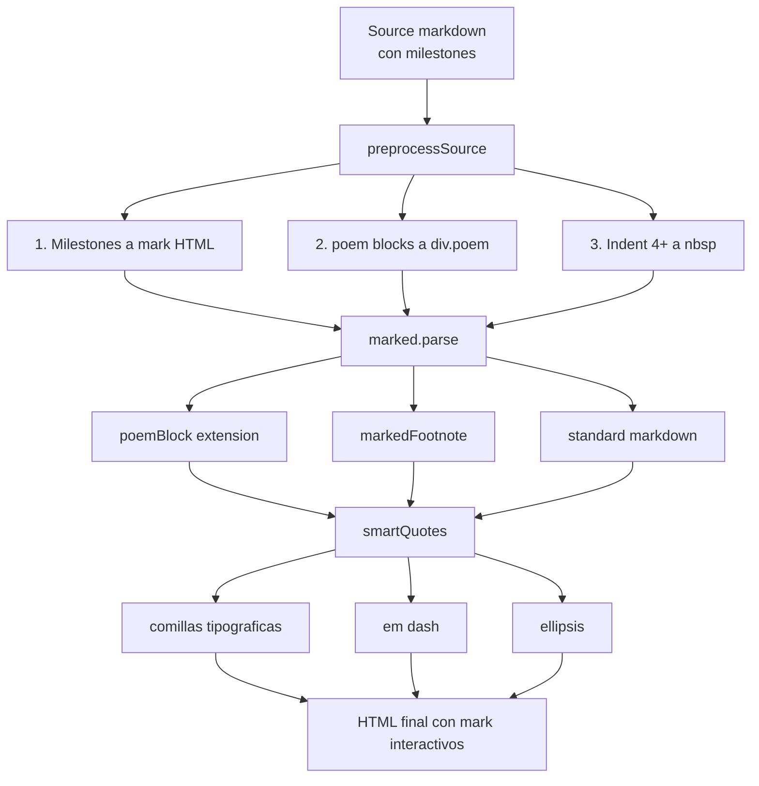

### Por que milestones se procesan ANTES de marked

Los milestones se convierten a `<mark>` HTML antes de que marked procese el texto.
Esto garantiza que funcionen dentro de **cualquier contexto markdown**:
blockquotes, listas, headers, poem blocks.

Si se usaran como inline extensions de marked, no funcionarian dentro de
blockquotes ni otros bloques donde marked no ejecuta extensiones inline.

## Modelo de datos

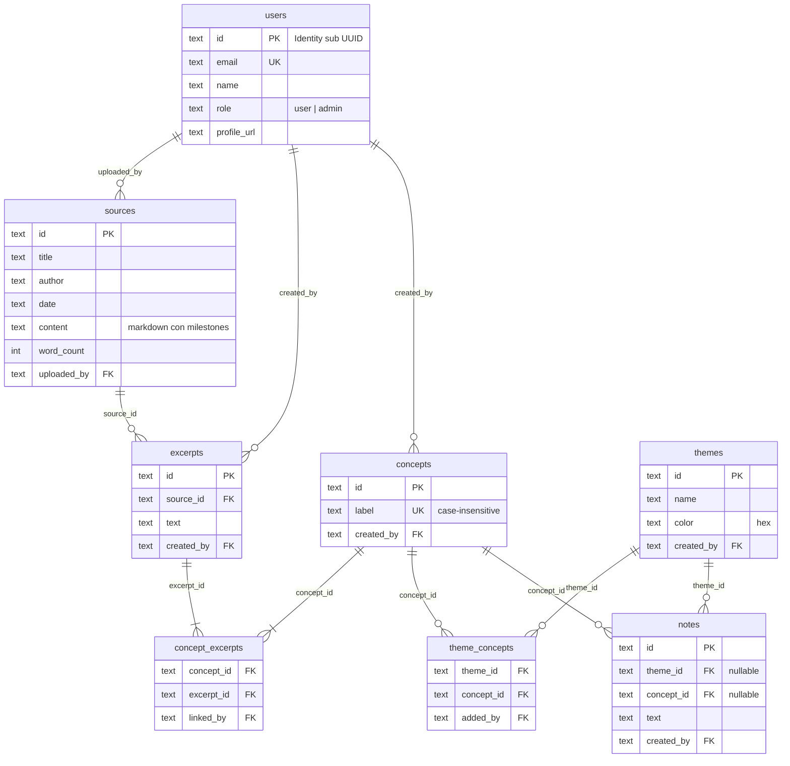

## Regla fundamental: no hay secciones huerfanas

Una seccion (excerpt) **siempre** tiene al menos 1 concepto asociado.

| Operacion | Donde se aplica | Logica |
|-----------|-----------------|--------|
| Crear seccion | `handleCreateExcerpt` | Se crea con concepto obligatorio |
| Desvincular concepto | `concepts.js` unlink-excerpt | Si excerpt queda con 0 conceptos: elimina excerpt + milestones |
| Eliminar concepto | `concepts.js` DELETE | Para cada excerpt: si queda con 0 conceptos, elimina |
| Frontend | `state.js` removeConceptFromExcerpt | Limpia state local si 0 conceptos |
| Frontend | `state.js` removeConcept | Limpia excerpts huerfanos del state |

## Flujos de operaciones

### Crear seccion

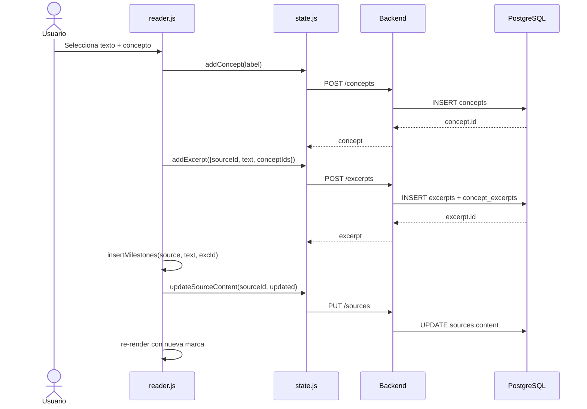

### Agregar concepto a seccion existente

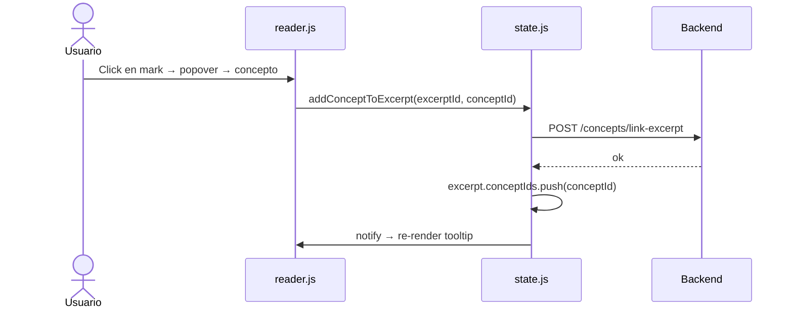

### Desvincular concepto (con regla de huerfanos)

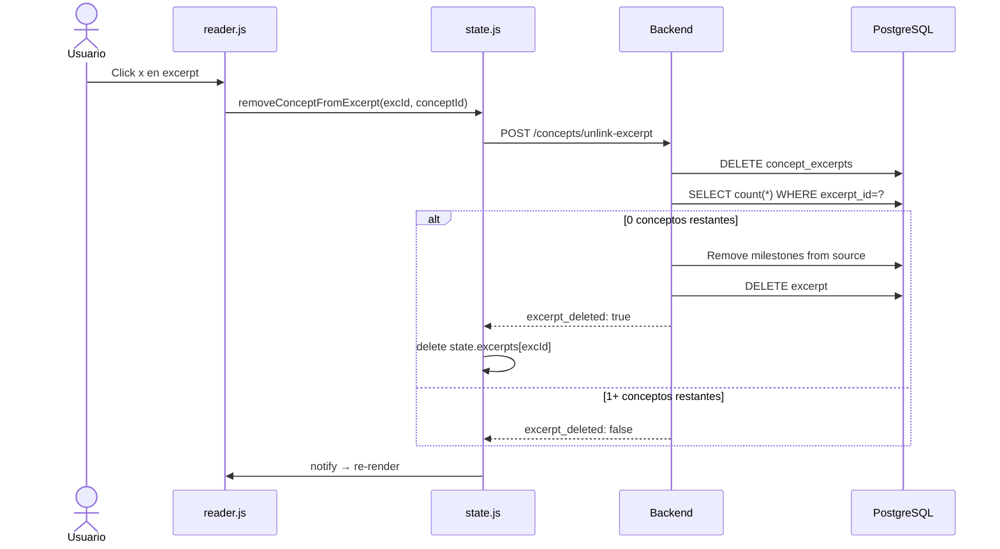

### Eliminar concepto (admin, cascada)

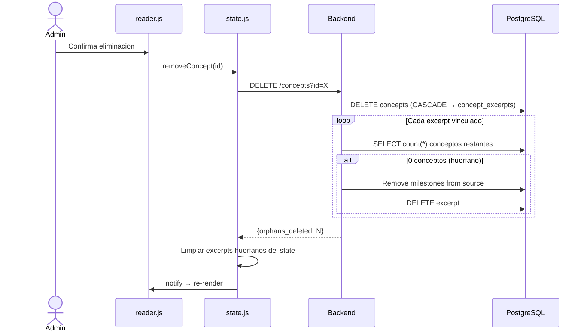

## Event delegation (interaccion robusta)

La interaccion con las marcas y la seleccion de texto usa **event delegation**:
un solo listener por tipo de evento en `.reader-text-wrapper`, que cubre
tanto `.reader-content` (texto) como `.reader-sidenotes` (notas al pie).

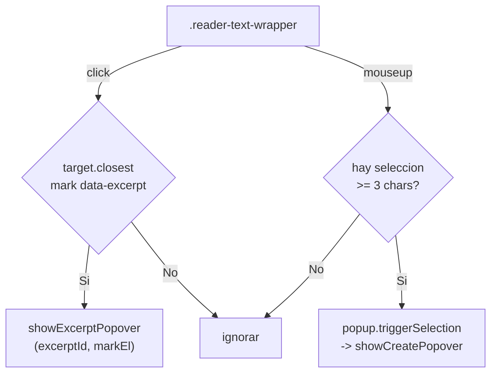

Ventajas sobre listeners individuales por `<mark>`:
- Funciona con marks creados dinamicamente (sin re-registrar)
- Un solo listener es mas eficiente que N
- Cubre sidenotes automaticamente
- No se rompe al re-renderizar el texto

Los listeners se registran **una sola vez** en `initReaderTab()` (reader.js).

## Popover unificado

Existe un solo componente popover para secciones, con dos modos:

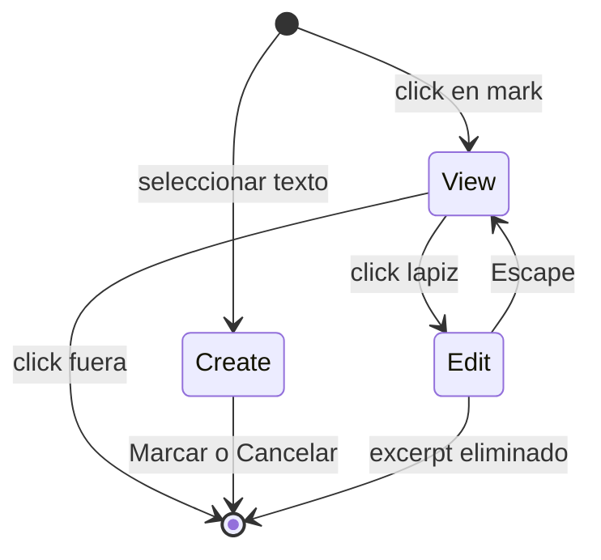

- **View**: pills de conceptos (read-only) + lapiz + basura
- **Edit**: pills con X para quitar + input autocomplete para agregar
- **Create**: input autocomplete + Marcar/Cancelar

El popover se posiciona `absolute` dentro de `.reader-text-wrapper`
(scrollea con el texto). Coordenadas via `getBoundingClientRect`
relativo al wrapper.

## Permisos

| Recurso | Crear | Editar | Eliminar |
|---------|-------|--------|----------|
| Fuente | admin | admin | admin |
| Seccion | user+ | - | propio o admin |
| Concepto | user+ | propio o admin (rename) | admin |
| Tema | user+ | propio o admin | admin |
| Nota | user+ | propio o admin | propio o admin |
| Vincular concepto-seccion | user+ | - | propio o admin |
| Perfil | propio | propio | - |
| Roles | - | admin | - |

## Filtros del mapa

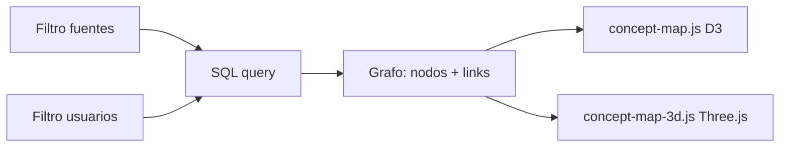

```
GET /api/graph?min_excerpts=1&sources=id1,id2&users=id1,id2
```

- `sources`: filtra excerpts por `source_id IN (...)`
- `users`: filtra por `created_by IN (...) OR linked_by IN (...)`
- Ambos: interseccion
- Sin filtros: grafo completo

## Sidenotes (notas al pie)

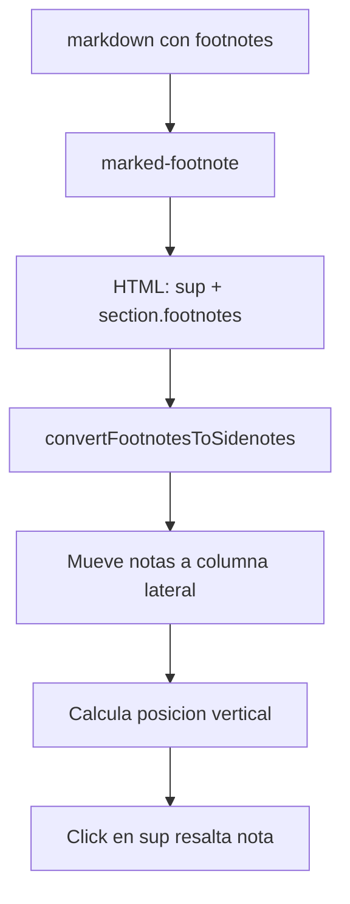

Las footnotes en markdown (`[^1]: texto`) se renderizan como sidenotes
en una columna lateral derecha, alineadas con su referencia `<sup>`.

## Auto-anotacion

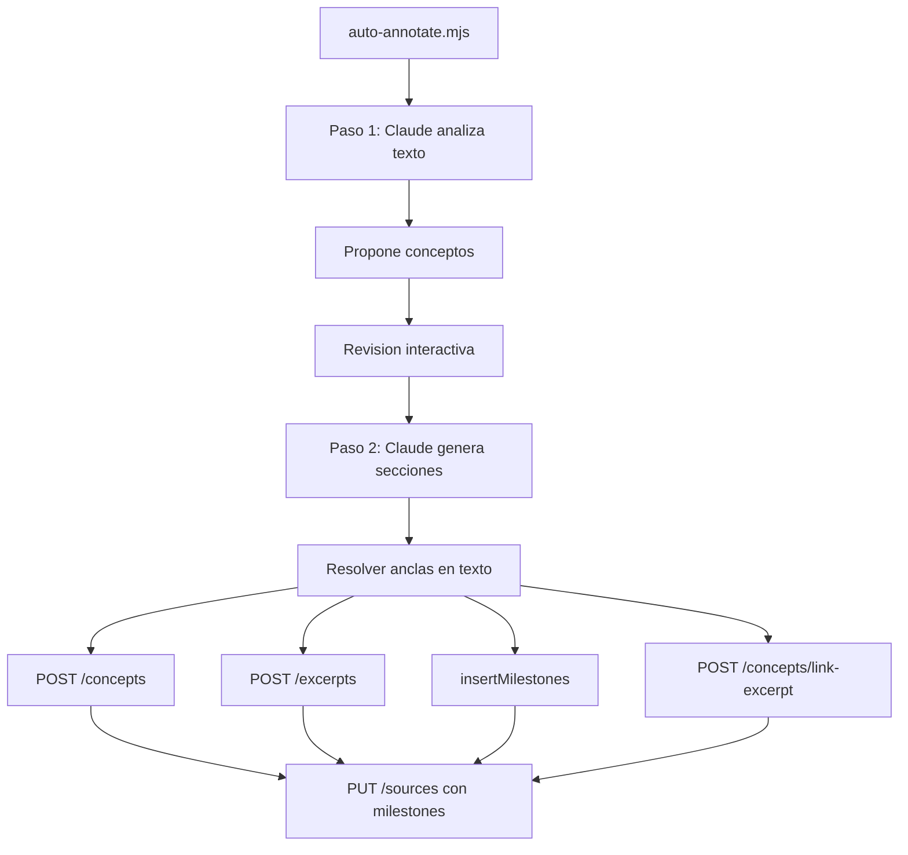

## Stack tecnico

| Capa | Tecnologia |
|------|------------|
| Frontend | Vanilla JS (ES6 modules), sin build step |
| Markdown | marked.js + marked-footnote |
| Mapas | D3.js (2D) + 3d-force-graph / Three.js (3D) |
| Backend | Netlify Functions (Node.js serverless) |
| Database | PostgreSQL (Neon) |
| Auth | Netlify Identity (Google OAuth) |
| Hosting | Netlify (CDN + Functions) |
| AI | Claude CLI (auto-annotate) |
