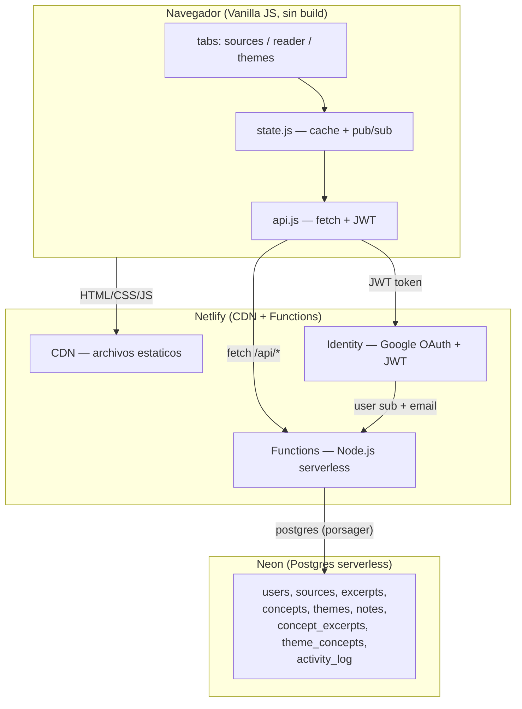
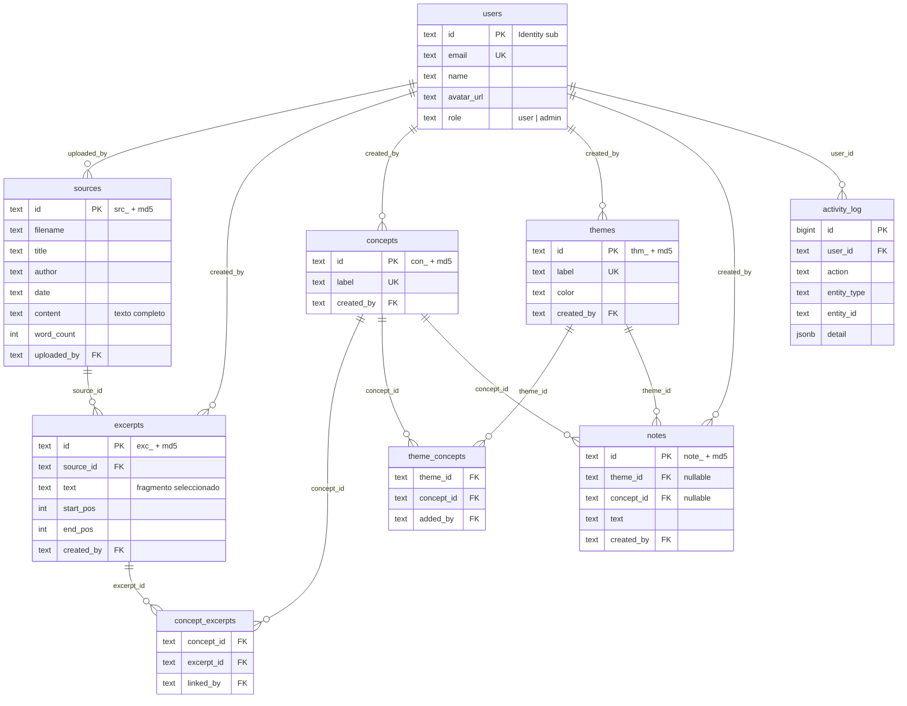
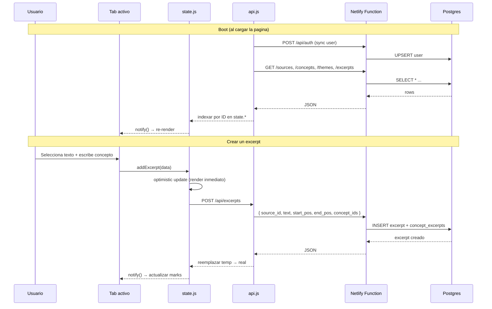
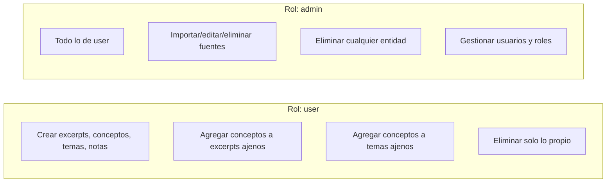
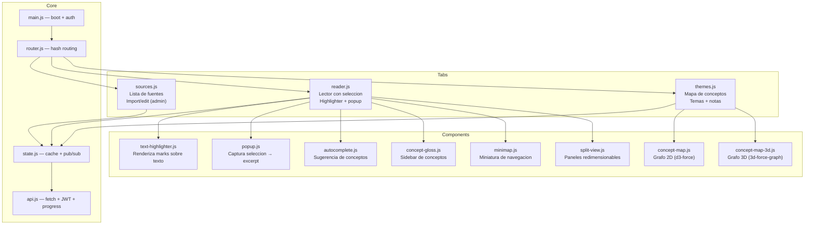

# con§tel-db -- Arquitectura

## Vision general

con§tel-db es una herramienta colaborativa de analisis tematico de corpus textuales. Un grupo de lectores trabaja sobre un corpus compartido: seleccionan fragmentos, les asignan conceptos, y agrupan conceptos en temas. El resultado es un mapa de relaciones conceptuales que emerge de la lectura colectiva.

## Stack



## Modelo de datos



## Flujo de datos en el frontend



## Permisos y ownership



Cada entidad registra quien la creo:

| Campo | Tabla | Significado |
|-------|-------|-------------|
| `uploaded_by` | sources | quien importo la fuente |
| `created_by` | excerpts, concepts, themes, notes | quien la creo |
| `linked_by` | concept_excerpts | quien vinculo concepto con seccion |
| `added_by` | theme_concepts | quien agrego concepto al tema |

## API REST

Todos los endpoints viven bajo `/api/*` (redirect via `netlify.toml`).

**Autenticacion:**
- GET = publico (sin JWT)
- POST/PUT/DELETE = requieren `Authorization: Bearer <JWT>` de Netlify Identity
- En dev local, si no hay JWT se usa el usuario de `.env` (`DEV_USER_*`)

### Sources

| Metodo | Ruta | Auth | Descripcion |
|--------|------|------|-------------|
| GET | `/api/sources` | -- | Lista fuentes (sin content, con excerpt_count) |
| GET | `/api/sources?id=X` | -- | Fuente con content |
| POST | `/api/sources` | admin | Crear fuente |
| PUT | `/api/sources` | admin | Actualizar fuente |
| DELETE | `/api/sources?id=X` | admin | Eliminar fuente + cascada |

### Excerpts

| Metodo | Ruta | Auth | Descripcion |
|--------|------|------|-------------|
| GET | `/api/excerpts` | -- | Todos los excerpts (boot) |
| GET | `/api/excerpts?source_id=X` | -- | Excerpts de una fuente |
| GET | `/api/excerpts?concept_id=X` | -- | Excerpts de un concepto |
| POST | `/api/excerpts` | JWT | Crear excerpt + vincular conceptos |
| DELETE | `/api/excerpts?id=X` | JWT | Eliminar (propio o admin) |

### Concepts

| Metodo | Ruta | Auth | Descripcion |
|--------|------|------|-------------|
| GET | `/api/concepts` | -- | Lista con excerpt_count y source_count |
| POST | `/api/concepts` | JWT | Crear concepto |
| PUT | `/api/concepts` | JWT | Renombrar (propio o admin) |
| DELETE | `/api/concepts?id=X` | admin | Eliminar concepto |
| POST | `/api/concepts/link-excerpt` | JWT | Vincular concepto-excerpt |
| POST | `/api/concepts/unlink-excerpt` | JWT | Desvincular (propio o admin) |

### Themes

| Metodo | Ruta | Auth | Descripcion |
|--------|------|------|-------------|
| GET | `/api/themes` | -- | Lista temas |
| POST | `/api/themes` | JWT | Crear tema |
| PUT | `/api/themes` | JWT | Actualizar (label, color) |
| DELETE | `/api/themes?id=X` | admin | Eliminar tema |
| POST | `/api/themes/add-concept` | JWT | Agregar concepto a tema |
| POST | `/api/themes/remove-concept` | JWT | Quitar concepto de tema |

### Notes

| Metodo | Ruta | Auth | Descripcion |
|--------|------|------|-------------|
| GET | `/api/notes?theme_id=X` | -- | Notas de un tema |
| GET | `/api/notes?concept_id=X` | -- | Notas de un concepto |
| POST | `/api/notes` | JWT | Crear nota (theme_id o concept_id) |
| PUT | `/api/notes` | JWT | Editar (propio o admin) |
| DELETE | `/api/notes?id=X` | JWT | Eliminar (propio o admin) |

### Graph

| Metodo | Ruta | Auth | Descripcion |
|--------|------|------|-------------|
| GET | `/api/graph` | -- | Grafo completo (nodes + links + themes) |
| GET | `/api/graph?source_id=X` | -- | Grafo filtrado por fuente |
| GET | `/api/graph?user_id=X` | -- | Grafo filtrado por usuario |

### Admin

| Metodo | Ruta | Auth | Descripcion |
|--------|------|------|-------------|
| GET | `/api/admin/users` | admin | Lista usuarios registrados |
| PUT | `/api/admin/users` | admin | Cambiar rol (user/admin) |
| GET | `/api/admin/activity` | admin | Log de actividad |
| GET | `/api/admin/stats` | admin | Estadisticas generales |

## Arquitectura del frontend



## Tipografia

| Uso | Fuente | Variable CSS | Pesos |
|-----|--------|-------------|-------|
| UI (botones, labels, nav) | Gabarito | `--font` | 400-700 |
| Lectura (reader) | Sorts Mill Goudy | `--font-reading` | 400, 400i |
| Editor / codigo / preview | IBM Plex Mono | `--mono` | 400, 400i, 700 |

IBM Plex Mono se sirve self-hosted desde `public/fonts/ibm-plex-mono/` (woff2).

## Desarrollo local

```bash
npm install
cp .env.example .env   # configurar DATABASE_URL
npx netlify dev         # localhost:8888
```

En local, sin JWT, las functions usan el dev user definido en `.env`:

```
DEV_USER_EMAIL=hspencer@ead.cl
DEV_USER_NAME=Herbert Spencer
DEV_USER_ID=user_mn5b5yb6
```

La DB es compartida entre dev y produccion (misma instancia Neon).

## Deploy

Push a `main` → Netlify auto-deploy (CDN + Functions). La DB se provisiona via Neon.
